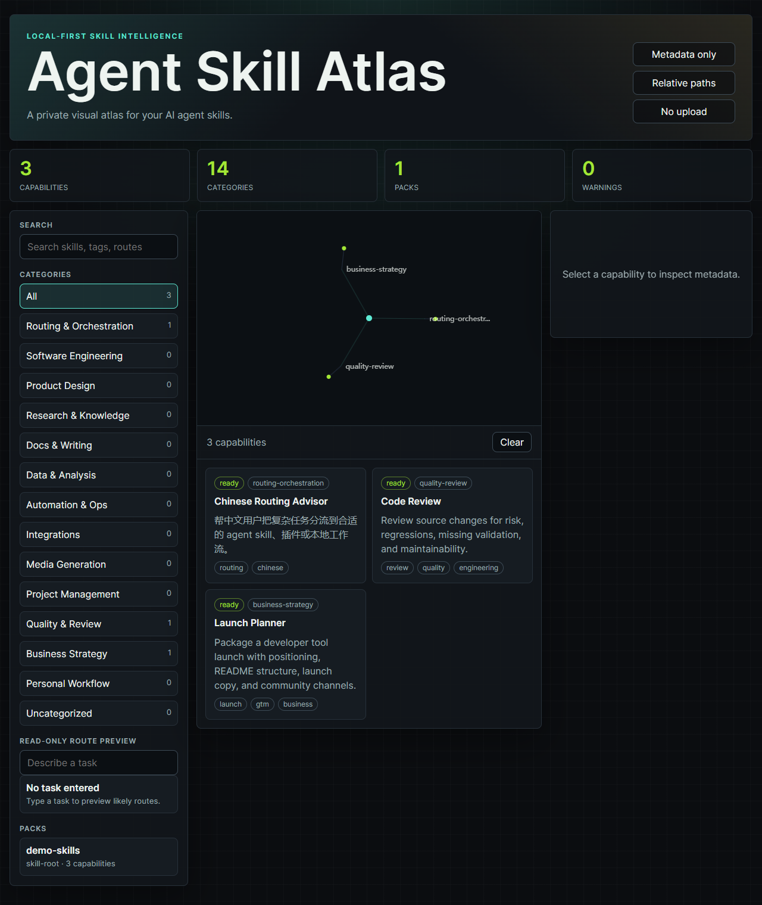

# Agent Skill Atlas

**A local-first visual atlas for your AI agent skills.**

Agent Skill Atlas scans local skill metadata from Codex, Claude, Cursor, or
other agent skill folders and turns it into a private searchable atlas. It is
not an awesome list and it does not publish your private skills. The default
scan exports only metadata such as name, description, category, route status,
tags, and relative path.

Agent Skill Atlas is an independent, unofficial open-source tool. It is not
affiliated with OpenAI, Anthropic, Cursor, or any agent platform vendor.



## Why This Exists

Agent skills are usually discovered through lightweight metadata first, while
the full instruction file is loaded later only when needed. That progressive
disclosure pattern is powerful, but it becomes hard to manage once a user has
dozens or hundreds of local skills and plugins.

Agent Skill Atlas gives that local system a visual management layer:

- Search skills by name, description, tag, and category.
- See category coverage and route readiness.
- Preview which skills might match a task without executing anything.
- Summarize large packs and plugins without copying private instruction bodies.
- Share a demo atlas or sanitized metadata without exposing real skill files.

## Quick Start

Install directly from GitHub:

```bash
npm install -g github:draculavan/agent-skill-atlas
agent-skill-atlas demo
```

Or run from a local clone:

```bash
git clone https://github.com/draculavan/agent-skill-atlas.git
cd agent-skill-atlas
npm install -g .
agent-skill-atlas scan --root examples/demo-skills --out examples/demo-atlas.json
agent-skill-atlas demo
```

Scan your own local skills:

```bash
agent-skill-atlas scan --root ~/.codex/skills --out atlas.json
agent-skill-atlas open --data atlas.json
```

If you omit `--root`, the CLI checks common local skill folders:

- `$CODEX_HOME/skills`
- `~/.codex/skills`
- `~/.agents/skills`

Plugin cache scanning is summary-only by default. Use `--include-plugins` only
when you explicitly want plugin skill metadata included.

## Privacy Guarantee

By default, Agent Skill Atlas:

- runs locally;
- exports metadata only;
- stores relative paths only;
- does not upload files;
- does not copy full `SKILL.md` bodies into `atlas.json`;
- ignores common auth, memory, logs, sessions, SQLite, cache, and private env
  paths.

Read the full policy in [docs/privacy.md](docs/privacy.md).

## CLI

```bash
agent-skill-atlas scan --root <path> --out atlas.json
agent-skill-atlas open --data atlas.json
agent-skill-atlas demo
```

Common flags:

- `--root <path>`: add a skill root. Can be repeated.
- `--out <path>`: write atlas JSON. Defaults to `atlas.json`.
- `--config <path>`: use a custom config file.
- `--include-plugins`: scan plugin cache skill metadata.
- `--pretty`: write formatted JSON.
- `--no-open`: start a local server without opening the browser.

## Data Model

`atlas.json` contains:

- `schemaVersion`
- `generatedAt`
- `counts`
- `categories`
- `capabilities`
- `packs`
- `diagnostics`

Each capability contains:

- `id`
- `name`
- `description`
- `kind`
- `source`
- `category`
- `relativePath`
- `tags`
- `routeStatus`
- `warnings`

No full skill body is included.

## Customization

Use `atlas.config.json` and `.atlasignore` to rename categories, override skill
classification, hide paths, and control plugin handling.

See [docs/customization.md](docs/customization.md).

## Development

```bash
npm test
npm run build
npm run scan:demo
npm run demo
```

On Windows PowerShell, if `npm` is blocked by execution policy, use `npm.cmd`
instead:

```powershell
npm.cmd test
npm.cmd run build
```

## Status

Agent Skill Atlas is public and usable as an early open-source release. The
scanner and UI are intentionally conservative: metadata first, local first, and
privacy first. Feedback about other agent skill folder layouts is welcome in
Issues or Discussions.
